# Configuration Architecture

This document provides a deep dive into the internal architecture, data flow, and design patterns used in this Neovim configuration.

## 🏗️ Overview

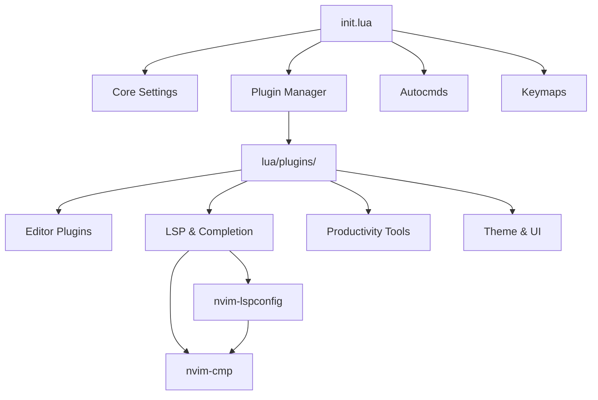

## 🔧 Bootstrapping Process

### 1. Initialization Sequence

The configuration follows a strict initialization order to ensure dependencies are loaded correctly:

```lua
-- init.lua
require("config.config")       -- 1. Set up Neovim environment
require("config.lazy-config")  -- 2. Bootstrap and load plugins
require("config.autocmds")     -- 3. Register automatic commands
require("keymaps.keymaps")     -- 4. Define keybindings
```

### 2. Lazy.nvim Bootstrap

When Neovim starts, the following process occurs:

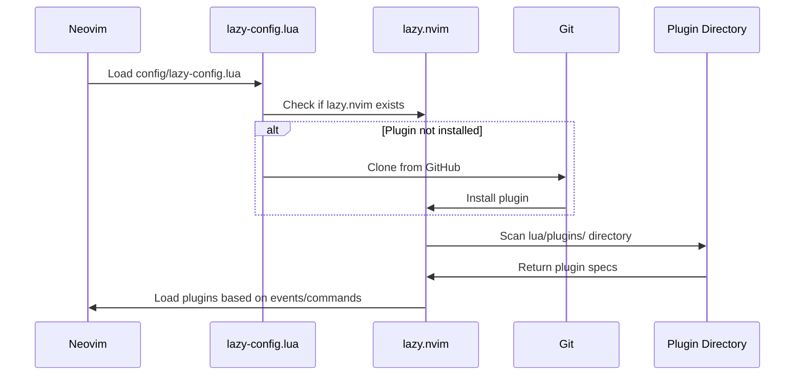

**Key Points:**
- Lazy.nvim is installed automatically on first run
- Plugins are loaded on-demand (lazy loading) based on:
  - `event` - Triggers on Neovim events (e.g., `BufReadPre`, `InsertEnter`)
  - `cmd` - Triggers when command is called (e.g., `:Telescope`)
  - `keys` - Triggers when keybinding is used
  - `ft` - Filetype-specific loading (not used in this config)

## 📦 Plugin Configuration Pattern

### Standard Plugin Spec

All plugins follow a consistent specification pattern:

```lua
return {
  'author/plugin-name',        -- Plugin repository
  branch = 'stable',           -- Optional: Git branch
  version = '*',               -- Optional: Version constraint
  dependencies = {             -- Required plugins
    'dependency-1',
    'dependency-2',
  },
  event = { 'BufReadPre' },    -- Lazy load trigger
  keys = { '<leader>f' },      -- Keybinding trigger
  cmd = { 'PluginCommand' },   -- Command trigger
  config = function()          -- Configuration callback
    require('plugin').setup({
      -- Plugin options
    })
  end,
}
```

### Dependency Management

Plugins can depend on other plugins. Lazy.nvim ensures correct load order:

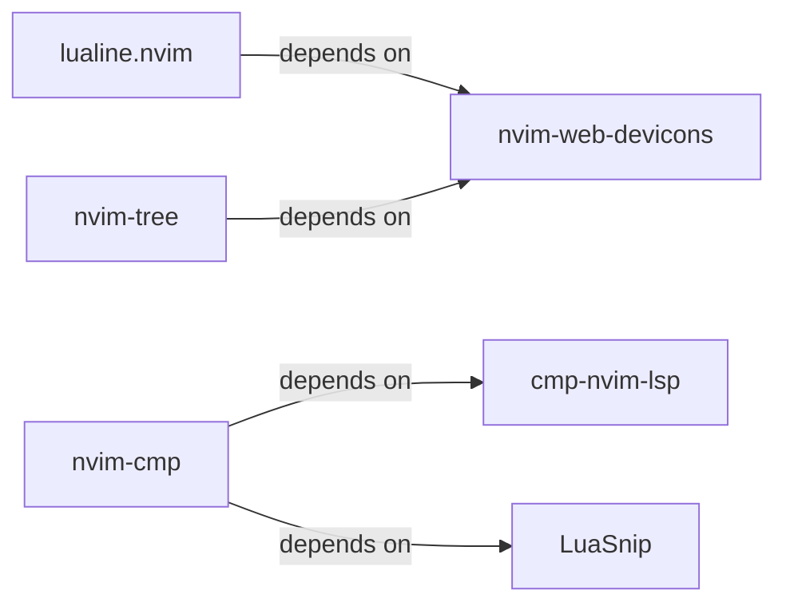

**Example from config:**

```lua
-- lua/plugins/nvim-cmp.lua
dependencies = {
  'hrsh7th/cmp-nvim-lsp',      -- Must load before nvim-cmp
  'L3MON4D3/LuaSnip',
  'saadparwaiz1/cmp_luasnip',
  'rafamadriz/friendly-snippets'
}
```

## 🌐 LSP Integration

### LSP Configuration Flow

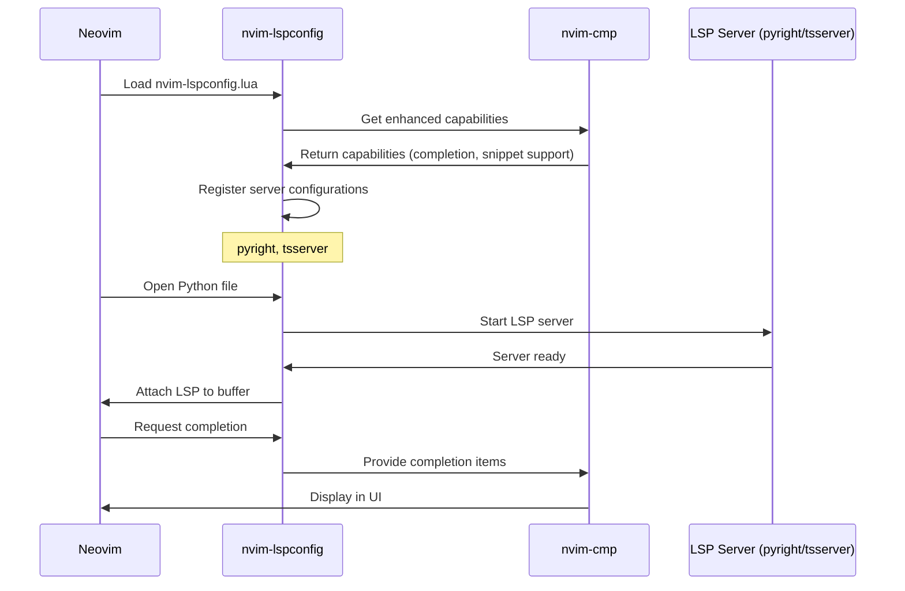

### Capability Negotiation

LSP servers need to know what the editor supports. The configuration enhances default capabilities:

```lua
-- lua/plugins/nvim-lspconfig.lua

-- 1. Get Neovim's default LSP capabilities
local capabilities = vim.lsp.protocol.make_client_capabilities()

-- 2. Extend with nvim-cmp capabilities (adds snippet support)
capabilities = require("cmp_nvim_lsp").default_capabilities(capabilities)

-- 3. Pass to server configuration
vim.lsp.config("pyright", {
  capabilities = capabilities,  -- Server now knows we support snippets
})
```

### LSP Server Activation

Servers are enabled globally but attach only to relevant buffers:

```lua
-- Enable servers globally
vim.lsp.enable({ "pyright", "tsserver" })

-- Attach happens automatically based on:
-- - File extension (.py → pyright)
-- - Detected filetype
-- - Root directory markers (pyproject.toml, package.json, etc.)
```

## 🔍 Autocomplete System

### nvim-cmp Architecture

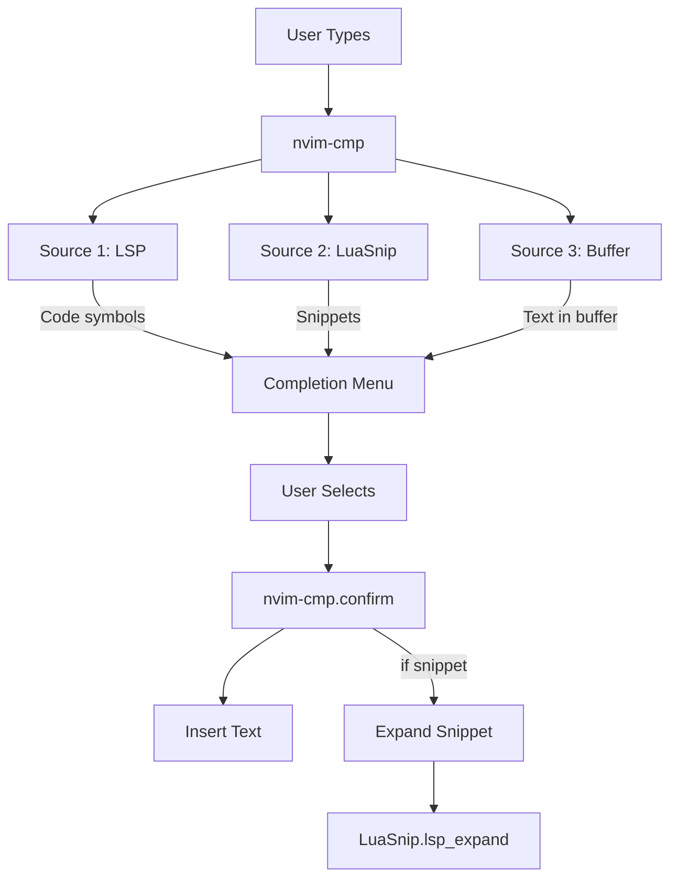

### Completion Source Configuration

```lua
sources = cmp.config.sources({
  { name = 'nvim_lsp' },  -- Priority 1: LSP completions
  { name = 'luasnip' },    -- Priority 2: Code snippets
}, {
  { name = 'buffer' },     -- Priority 3: Words in current buffer
})
```

### Snippet Engine Integration

The configuration uses **LuaSnip** with VS Code-compatible snippets:

```lua
-- Load VS Code style snippets
require('luasnip.loaders.from_vscode').lazy_load()

-- Use with nvim-cmp
snippet = {
  expand = function(args)
    luasnip.lsp_expand(args.body)  -- Expand snippet placeholders
  end,
}
```

## 🌳 Tree-sitter Integration

### Syntax Highlighting Flow

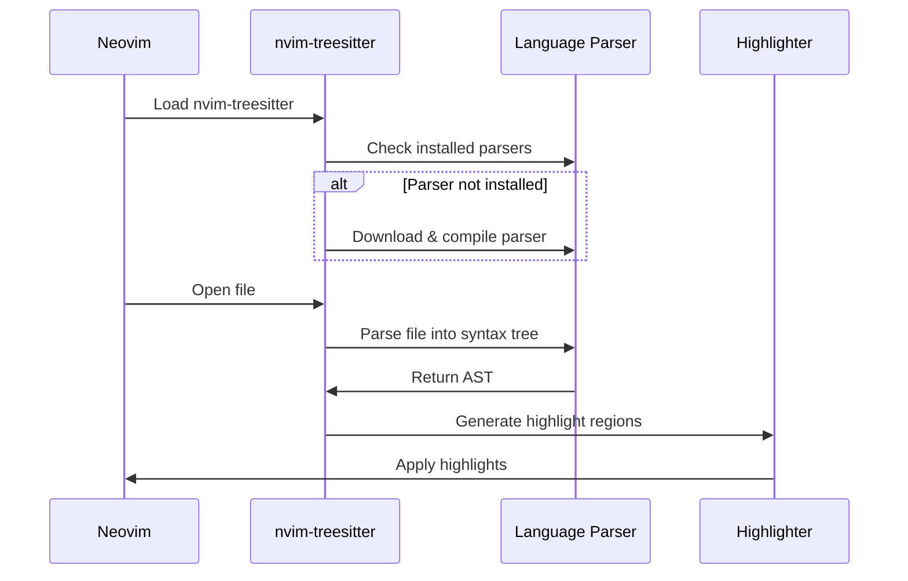

### Parser Installation

Parsers are installed automatically on first use:

```lua
-- lua/plugins/nvim-treesitter.lua

ensure_installed = {
  'c', 'lua', 'python', 'javascript', 'typescript'
}

-- Installation happens via:
-- :TSUpdate  or automatically on :TSInstall
```

**Installation Process:**
1. Tree-sitter downloads parser for language
2. Parser is compiled to shared library
3. Neovim loads parser at runtime
4. Files are parsed incrementally for performance

## 🔭 Telescope Integration

### Picker Configuration

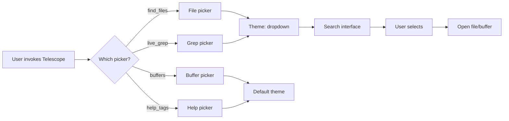

### Custom Mappings

The configuration adds custom keybindings for Telescope's insert mode:

```lua
mappings = {
  i = {
    ["<C-j>"] = actions.move_selection_next,      -- Navigate down
    ["<C-k>"] = actions.move_selection_previous,  -- Navigate up
    ["<C-q>"] = function(prompt_bufnr)
      actions.send_selected_to_qflist(prompt_bufnr)
      actions.open_qflist()                       -- Send to quickfix
    end,
  },
}
```

**Why these mappings?**
- `<C-j>/<C-k>`: Consistent with window navigation
- `<C-q>`: Common Vim pattern for quickfix operations

## 🎨 Theme Integration

### Theme Loading Process

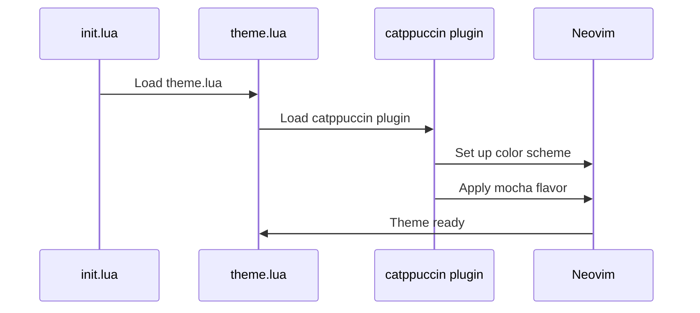

### Plugin Priority

```lua
-- lua/plugins/theme.lua
return {
  "catppuccin/nvim",
  name = "catppuccin",
  priority = 1000,  -- Ensure theme loads before other plugins
  config = function()
    vim.cmd('colorscheme catppuccin-mocha')
  end,
}
```

**Why priority 1000?**
- Ensures theme is available for other plugins that reference highlight groups
- Lualine, Telescope, etc., can inherit theme colors

## ⌨️ Keybinding Architecture

### Keymap Definition Pattern

```lua
-- lua/keymaps/keymaps.lua

local map = vim.keymap.set      -- Neovim 0.7+ API
local opts = { silent = true, noremap = true }

map('n', '<C-h>', '<C-w>h', opts)  -- Normal mode
map('v', '<C-c>', '"+y', opts)    -- Visual mode
map('i', '<C-s>', '<Esc>:w<CR>', opts)  -- Insert mode
```

**Parameters:**
- `silent`: Don't echo command output
- `noremap`: Don't remap again (prevent recursion)

### Keybinding Layers

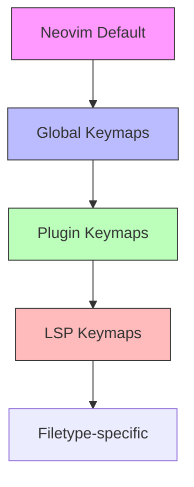

### Keybinding Resolution Order

When a key is pressed, Neovim checks in this order:
1. **LSP keymaps** (buffer-local)
2. **Plugin keymaps** (buffer-local or global)
3. **Global keymaps** (lua/keymaps/)
4. **Vim default keymaps**

**Example: `<leader>e`**
- Defined in `nvim-tree.lua`: `{ '<leader>e', ':NvimTreeToggle<CR>' }`
- Lazy-nvim creates the mapping when `<leader>e` is pressed
- Plugin is loaded on-demand
- Command executes

## 🔄 Autocommand System

### Autocommand Architecture

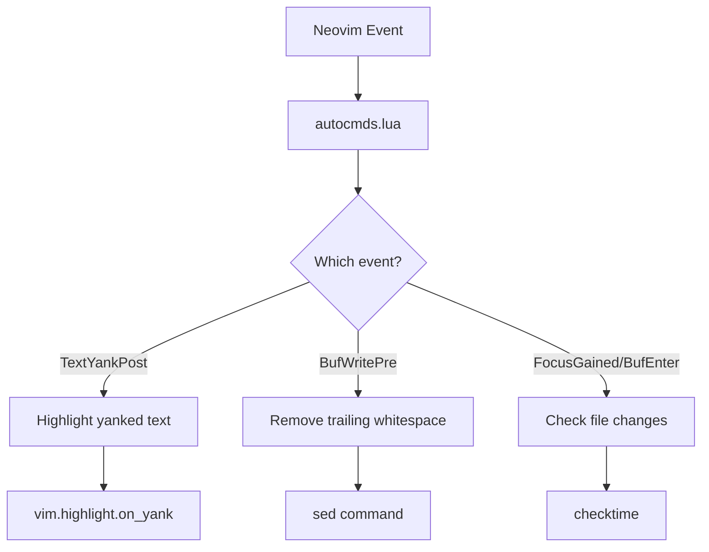

### Autocommand Implementation

```lua
-- lua/config/autocmds.lua

-- 1. TextYankPost - Highlight when yanking (copying)
vim.api.nvim_create_autocmd('TextYankPost', {
  callback = function()
    vim.highlight.on_yank({ higroup = 'IncSearch', timeout = 200 })
  end,
})

-- 2. BufWritePre - Clean up before saving
vim.api.nvim_create_autocmd('BufWritePre', {
  pattern = '*',              -- All file types
  command = [[%s/\s\+$//e]],  -- Remove trailing spaces
})

-- 3. FocusGained/BufEnter - Reload changed files
vim.api.nvim_create_autocmd({ 'FocusGained', 'BufEnter' }, {
  command = 'checktime',      -- Check for external changes
})
```

## 📊 Performance Optimization

### Lazy Loading Strategy

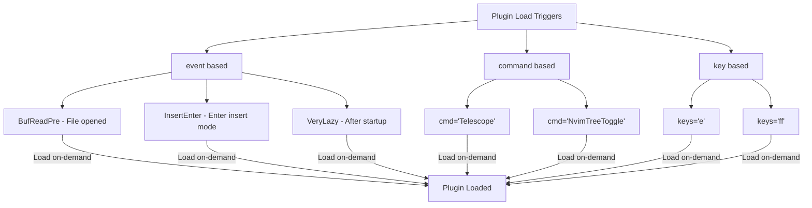

### Load Triggers by Plugin

| Plugin | Trigger Type | Event/Command |
|--------|--------------|---------------|
| nvim-lspconfig | event | `BufReadPre`, `BufNewFile` |
| nvim-treesitter | event | `BufReadPost`, `BufNewFile` |
| gitsigns | event | `BufReadPre`, `BufNewFile` |
| nvim-tree | cmd/keys | `NvimTreeToggle`, `<leader>e` |
| telescope | cmd/keys | `Telescope`, `<leader>f*` |
| nvim-autopairs | event | `InsertEnter` |
| nvim-cmp | event | `InsertEnter` |
| lualine | event | `VeryLazy` |
| wakatime | lazy=false | Immediate load |
| catppuccin | priority=1000 | Load first |

## 🔧 Extension Points

### Adding a New Plugin

**Step 1**: Create plugin spec file
```bash
touch lua/plugins/my-plugin.lua
```

**Step 2**: Write configuration
```lua
return {
  'author/my-plugin',
  event = 'BufReadPre',  -- Choose appropriate trigger
  config = function()
    require('my-plugin').setup({
      -- Plugin options
    })
  end,
}
```

**Step 3**: Add keybindings (optional)
```lua
keys = {
  { '<leader>m', ':MyPluginCommand<CR>', desc = 'Run my plugin' },
},
```

### Adding a New Language Server

Edit `lua/plugins/nvim-lspconfig.lua`:

```lua
-- Add server configuration
vim.lsp.config("rust-analyzer", {
  capabilities = capabilities,
  settings = {
    ['rust-analyzer'] = {
      checkOnSave = {
        command = "clippy"
      }
    }
  }
})

-- Enable the server
vim.lsp.enable({ "pyright", "tsserver", "rust-analyzer" })
```

### Customizing the Theme

Create a custom theme by extending Catppuccin:

```lua
-- lua/plugins/theme.lua
return {
  "catppuccin/nvim",
  config = function()
    require("catppuccin").setup({
      flavour = "mocha",
      color_overrides = {
        mocha = {
          base = "#1e1e2e",  -- Custom background
          mantle = "#181825",
        },
      },
      integrations = {
        telescope = true,
        nvimtree = true,
      },
    })
    vim.cmd("colorscheme catppuccin-mocha")
  end,
}
```

## 🐛 Debugging Architecture

### Enabling Debug Logs

```vim
" Enable verbose logging
:lua vim.lsp.set_log_level("debug")

" Open log file
:lua vim.cmd('e' .. vim.lsp.get_log_path())

" Check loaded plugins
:Lazy

" Check LSP status
:LspInfo

" Check Tree-sitter parsers
:TSModuleInfo
```

### Tracing Plugin Loading

```vim
" Profile startup time
nvim --startuptime startup.log

" Profile lazy.nvim
:Lazy profile

" Trace autocmds
:autocmd verbose
```

## 📈 Configuration Data Flow

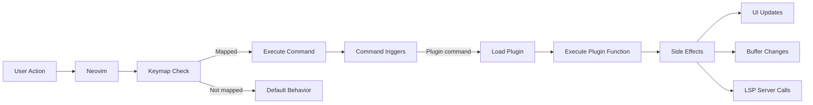

## 🎯 Design Principles

1. **Lazy Loading**: Plugins load only when needed for fast startup
2. **Modular Structure**: Each plugin in separate file for maintainability
3. **Event-Driven**: Configuration responds to Neovim events, not hardcoded states
4. **Non-Intrusive**: Plugins respect Vim defaults unless explicitly overridden
5. **Declarative**: Plugin specs declare intent, not implementation details
6. **Type-Safe**: Lua provides better tooling compared to Vimscript

## 📚 Further Reading

- [Neovim Lua Development](https://neovim.io/doc/user/lua.html)
- [lazy.nvim Documentation](https://github.com/folke/lazy.nvim)
- [nvim-lspconfig Configuration](https://github.com/neovim/nvim-lspconfig)
- [Tree-sitter Internals](https://tree-sitter.github.io/tree-sitter/)
- [Neovim Autocommands](https://neovim.io/doc/user/autocmd.html)

---

*Last Updated: January 2026*
